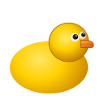
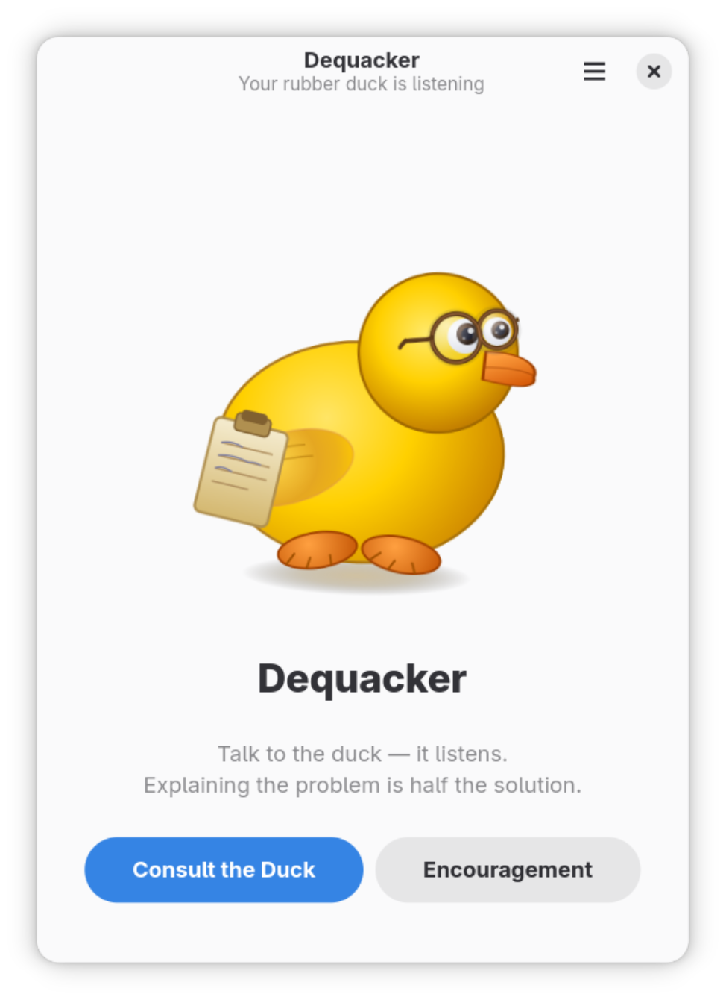
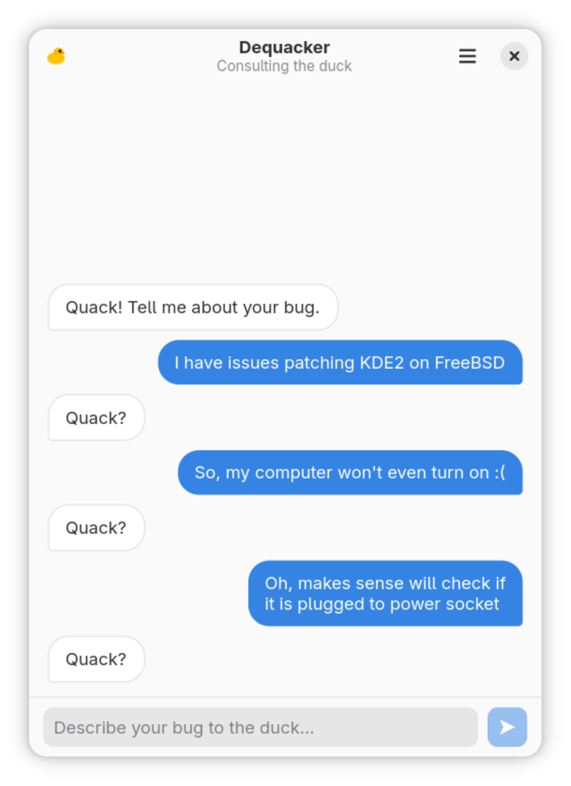

# Dequacker

<p align="center">
  
</p>
<p align="center">
  A rubber duck debugging tool
</p>
<p align="center">
  
  &nbsp;&nbsp;
  
</p>

A very simple rubber duck debugging tool. When you are stuck on a bug, describe
it out loud to the duck. Alternativly, there's simple chat option for a quiet debugging. The act of articulating the problem is often enough to
reveal the solution.

Built with Python, GTK4, and libadwaita. 
I am only learning so it was developed with the assistance of
Claude (Anthropic). The idea is to learn and rewrite the tool fully bymuself in future. 
The Dequacker was created as a helpful tool for myself, but if you have any ideas, please feel free to contribute.


## Installation

### From source

Requires Python 3.11+, GTK 4.14+, libadwaita 1.5+.

```bash
git clone https://github.com/alexeyfdv/dequacker.git
cd dequacker
python3 src/main.py
```

### Build the Flatpak locally

```bash
flatpak install flathub org.gnome.Platform//47 org.gnome.Sdk//47
flatpak-builder --user --install --force-clean build-dir \
    io.github.alexeyfdv.dequacker.yml
flatpak run io.github.alexeyfdv.dequacker
```
I think, I won't upload it to flathub since most of the code was writen by AI. Maybe after I rewrite it fully by myself.

## License

GPL-3.0-or-later. See [COPYING](COPYING).
